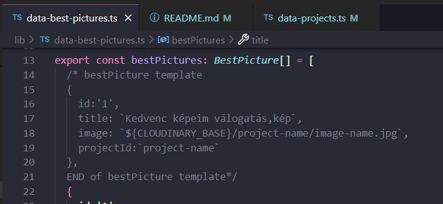

[Portfolio](https://eszter-with-a-z.github.io/egyheppem-portfolio/projects/) for my amazing friend and photographer, Zsófi!

## Instructions
### Before any changes
- get github folder and make sure you can commit and sync changes
## Content
[Hogy adjak hozzá egy új projektet?](#hogy-adjak-hozza-egy-uj-projektet)
[Hogy változtassam meg a "Kedvenc Képeim"-et?](#hogy-valtoztassam-meg-a-kedvenc-kepeim-et)
### Hogy adjak hozzá egy új projektet?
#### 1. Képek előkészítése
1.1. Tedd az összes képet egy a projekt nevével azonos mappába a gépeden
> [!TIP]
> Én a biztonság kedvéért kisbetűvel, ekezetek nelkul, kotojelle-elvalasztva szoktam elnevezni a mappát.

1.2. Tömörítsd a 10MB-nál nagyobb képeket (vagy az összeset)
> [!TIP]
> Windows-nál, ha az összes kép egy mappában van, View>Details legyen a nézeted. Kattints a Size-ra, hogy automatikusan csökkenő sorrendbe rendezze a fájlokat méret alapján
> Azokat, amelyikek 10MB (10.000KB)-nál nagyobbak, rakd egy almappába (pl. to-compress).
> A tömörített képeket rakd a mappába a többivel együtt (a size filterrel ellenőrizd, h 10MB alatt van-e)

1.3. Nevezd át az összes képet project-name (i), ahol az i az adott kép sorszámát jelöli
> [!TIP]
> Windows billentyűkombináció, hogy az összeset egyszerre nevezd át:
> 1. CTRL+A -> hogy az összes fájlt kijelöld -----> (Fn) + F2 ---> Írd be a projekt nevét, automatikusan hozzáadja a sorszámot

1.4. Jelentkezz be Cloudinary-n
1.5. A bal fülön: Assets > Folders > portfolio > projects
1.6. A Assets > Folders > portfolio > projects-en belül addj hozzá egy mappát a project nevével
1.7. Töltsd fel az összes képet a mappába!
#### 2. A kód módosítása
2.1. Nyisd meg a lib/data-projects.ts fájlt!
2.2. Másold ki a kommentekből a sablont, és töltsd ki az utasításoknak megfelelően attól függően, hogy van-e almappája vagy nem!

### Hogy változtassam meg a "Kedvenc Képeim"-et?
0. Bizonyosodj meg afelől, hogy a kép, amit fel akarsz tölteni, a projektek között van (Cloudinary> portfolio/projects/project-name_i.jpg), és másold ki az URL-ját!
1. Nyisd meg a lib/data-best-pictures.ts fájlt!
2. Másold ki a kommentekből a sablont, és töltsd ki az utasításoknak megfelelően!

| Stage         | Command           | Description                         |
| ------------- | ----------------- | ----------------------------------- |
| Development   | `npm run dev`     | Start local dev server (hot reload); opens http://localhost:3000 |
| Build         | `npm run build`   | Build static files|

Zsófi, ha bármi további kérdésed van, keress nyugodtan! ^.^